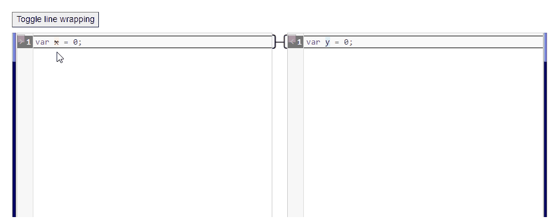
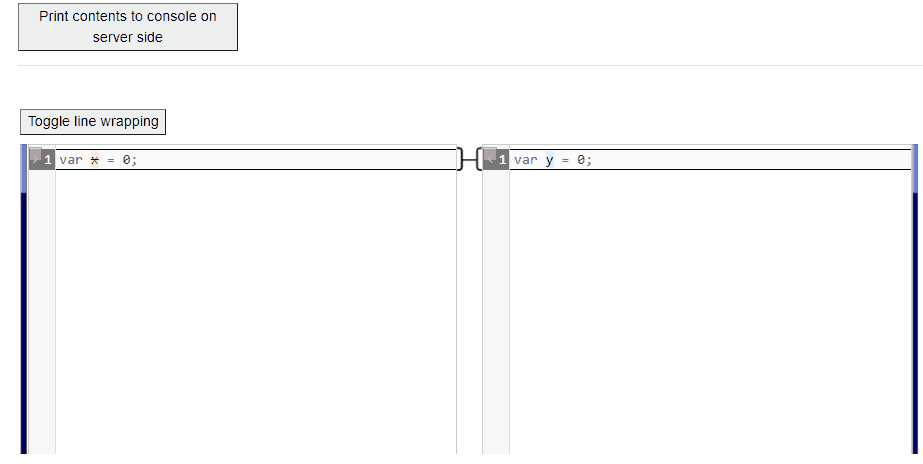

# BlazorMergely

An implementation of Blazor diff and merge component based on Mergely with server side support.


* [com.github.akovac35.BlazorMergely](https://www.nuget.org/packages/com.github.akovac35.BlazorMergely/)

	[](https://www.nuget.org/packages/com.github.akovac35.BlazorMergely/)

Browser functionality:



Interaction with the server:



## Status

PRODUCTION READY starting from version 1.0.0.

## Usage

Update _Host.cshtml file with static file references as follows:

```cshtml
@using com.github.akovac35.BlazorMergely

@* BlazorMergely CSS references *@
<component type="typeof(BlazorMergelyCssReferences)" render-mode="Static"/>

@* BlazorMergely JS references *@
<component type="typeof(BlazorMergelyJsReferences)" render-mode="Static"/>
```

The above may not meet some specific application criteria like jQuery version etc. In that case simply add the required static file references manually, as per the following examples:

* [BlazorMergelyCssReferences](src/com.github.akovac35.BlazorMergely/BlazorMergelyCssReferences.razor)
* [BlazorMergelyJsReferences](src/com.github.akovac35.BlazorMergely/BlazorMergelyJsReferences.cs)

Then use the component as follows:

```razor
@using com.github.akovac35.BlazorMergely

<div class="form-row">
	<div class="col-3">
		<button @onclick=@PrintContentsToConsoleOnServerSide>Print contents to console on server side</button>
	</div>
</div>

<hr />
<br />

<div class="form-row">
	<div class="col" style="height:400px">
		<BlazorMergelyComponent @ref="BlazorMergelyComponentInstance" MergelyOptions=@MergelyOptions />
	</div>
</div>

@code{
	private BlazorMergelyComponent? BlazorMergelyComponentInstance { get; set; }
	private string MergelyOptions { get; set; } = "{\"cmsettings\":{\"mode\":\"text/javascript\",\"readOnly\":false,\"styleSelectedText\": true}}"; // This is optional
	
	private TestModel TestModelInstance { get; set; } = new() { LeftValue = "var x = 0;", RightValue = "var y = 0;" };

	protected override async Task OnAfterRenderAsync(bool firstRender)
	{
		await base.OnAfterRenderAsync(firstRender);
		
		// Component reference is set after the first render
		if(firstRender)
		{
			await BlazorMergelyComponentInstance!.SetValueAsync(TestModelInstance.LeftValue, TestModelInstance.RightValue);
		}
	}

	private async Task PrintContentsToConsoleOnServerSide(MouseEventArgs args)
	{
		var contents = await BlazorMergelyComponentInstance!.GetValuesAsync();
		Console.WriteLine(contents.Left);
		Console.WriteLine(contents.Right);
	}
}
```

All methods and properties are listed here: [BlazorMergelyComponent.razor.cs](src/com.github.akovac35.BlazorMergely/BlazorMergelyComponent.razor.cs)

## Samples

Review the following samples:

* [BlazorMergelySimpleTest](instance/BlazorMergelyWebApp/Pages/BlazorMergelySimpleTest.razor)
* [BlazorMergelyTest](instance/BlazorMergelyWebApp/Pages/BlazorMergelyTest.razor)

Clone this repository locally, navigate to `instance/BlazorMergelyWebApp` and issue the `dotnet run` command.

## Release history

* 1.0.0 - Production ready.

## Contributing

Pull requests are welcome. For major changes, please open an issue first to discuss what you would like to change.

Please make sure to update tests as appropriate.

## Credits

Based on Mergely javascript library: [www.mergely.com](https://mergely.com/)

## License
[LGPL-2.1](LICENSE)